# develepor_domumentation

# Utvecklardokumentation för Kakburkar Beställningssystem

## Översikt

Detta system är utformat för att hantera beställningar av kakburkar. Användaren kan lägga till beställningar för olika typer av kakburkar och systemet kommer att hålla reda på alla beställningar.

## Systemarkitektur
Här är en Mermaid-diagram som visar systemarkitekturen:

## Kodstruktur

Huvudprogrammet är `main.py`, som innehåller all logik för att hantera beställningar. Det använder en dictionary `bestallningar` för att lagra alla beställningar. Nycklarna i denna dictionary är användarnamn och värdena är en annan dictionary där nycklarna är kaksorter och värdena är antalet beställda kakburkar.

Programmet körs i en oändlig loop tills användaren väljer att avsluta. I varje iteration av loopen visas de aktuella beställningarna, användaren ombeds att ange sitt namn och välja en kaksort, och sedan ange antalet kakburkar de vill beställa. Om användaren inte finns i `bestallningar` läggs de till, och deras beställning läggs till under deras namn.

När programmet avslutas skrivs alla beställningar ut till en textfil.

## Användning

För att köra programmet, kör `main.py` med Python 3.

## Licens

Detta projekt är licensierat under The Unlicense.